<div align="center">

# 🍽️ Mess App

### Smart Mess & Hostel Management Solution

[](https://expo.dev/)
[](https://reactnative.dev/)
[](https://www.typescriptlang.org/)
[](https://firebase.google.com/)
[](https://opensource.org/licenses/MIT)

**A modern, feature-rich mobile application for seamless mess and hostel management. Track members, expenses, meals, and deposits with real-time updates and beautiful UI.**

[Features](#-features) • [Screenshots](#-screenshots) • [Installation](#-installation) • [Tech Stack](#️-tech-stack) • [Contributing](#-contributing)

</div>

---

## 📱 Screenshots

<div align="center">

### 🔐 Authentication & Onboarding

<table>
<tr>
<td align="center" width="25%">
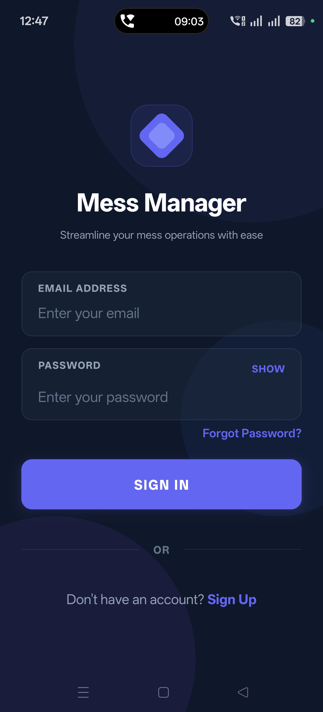<br />
<b>Login</b><br />
<sub>Secure authentication</sub>
</td>
<td align="center" width="25%">
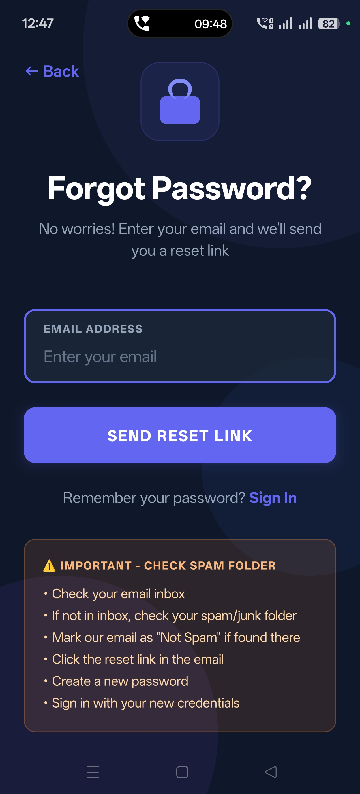<br />
<b>Forgot Password</b><br />
<sub>Password recovery</sub>
</td>
   
<td align="center" width="25%">
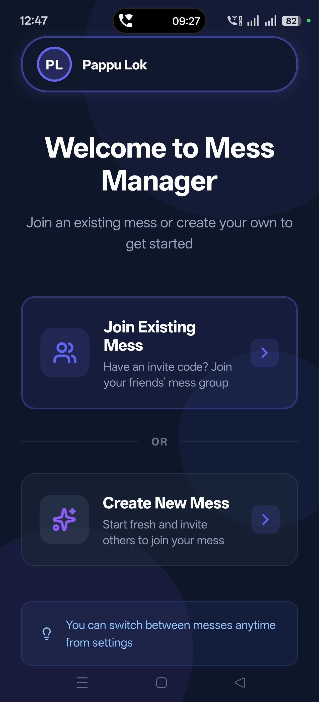<br />
<b>Select Mess</b><br />
<sub>Choose your mess</sub>
</td>
<td align="center" width="33%">
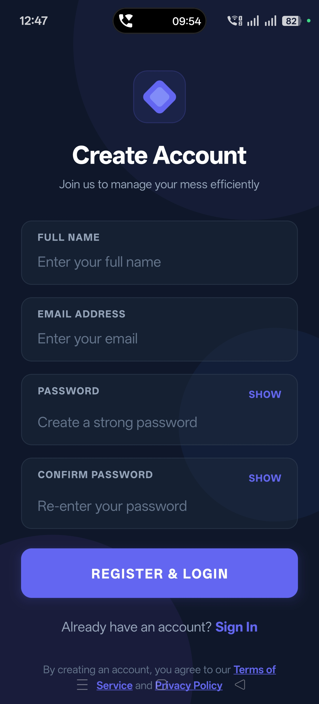<br />
<b>Create Account</b><br />
<sub>Setup your mess details</sub>
</td>
</tr>
</table>

### 🏗️ Mess Creation & Setup

<table>
<tr>
<td align="center" width="33%">
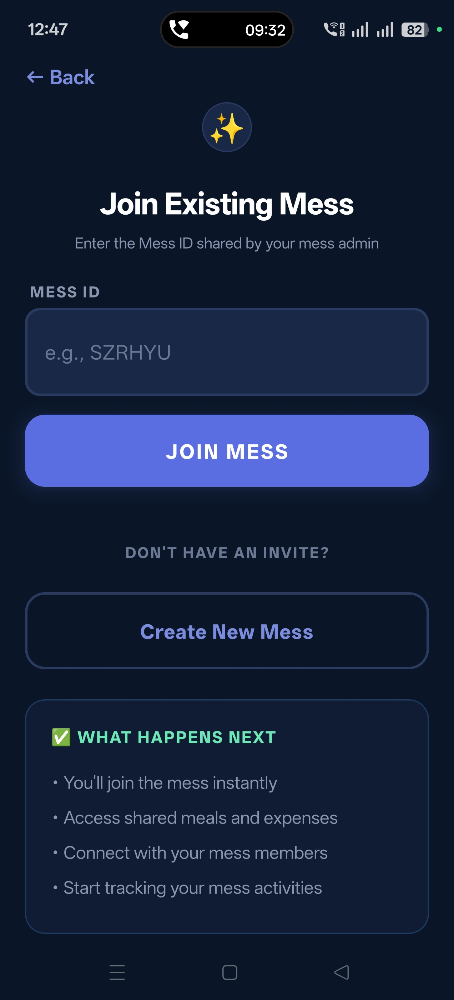<br />
<b>Join Mess</b><br />
<sub>Join existing mess</sub>
</td>
<td align="center" width="33%">
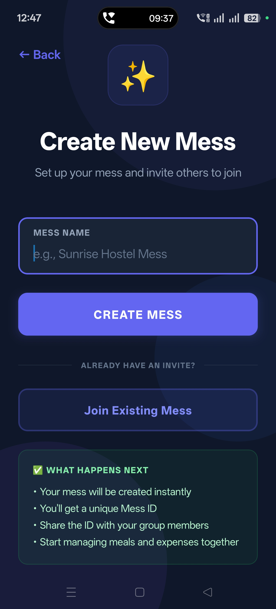<br />
<b>Create Mess</b><br />
<sub>Create  mess </sub>
</td>
<td align="center" width="33%">
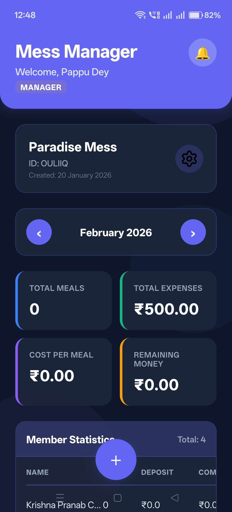<br />
<b>Member Dashboard</b><br />
<sub>Overview for members</sub>
</td>
</tr>
</table>

### 📊 Dashboard & Management

<table>
<tr>
<td align="center" width="25%">
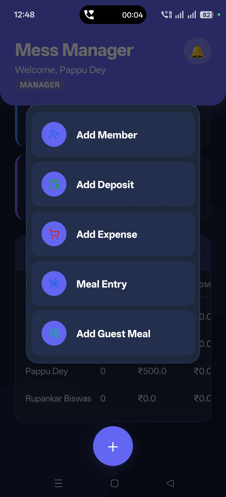<br />
<b>Manager Dashboard</b><br />
<sub>Complete mess overview</sub>
</td>
<td align="center" width="25%">
<br />
<b>Members</b><br />
<sub>Manage all members</sub>
</td>
<td align="center" width="25%">
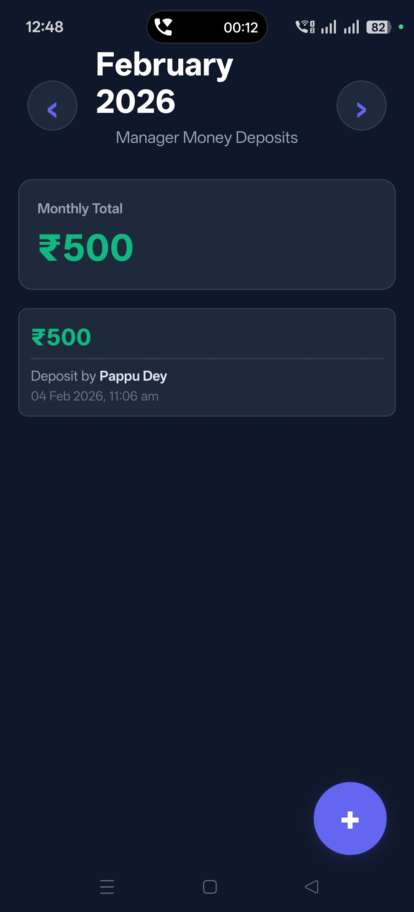<br />
<b>Deposits</b><br />
<sub>Track member deposits</sub>
</td>
<td align="center" width="25%">
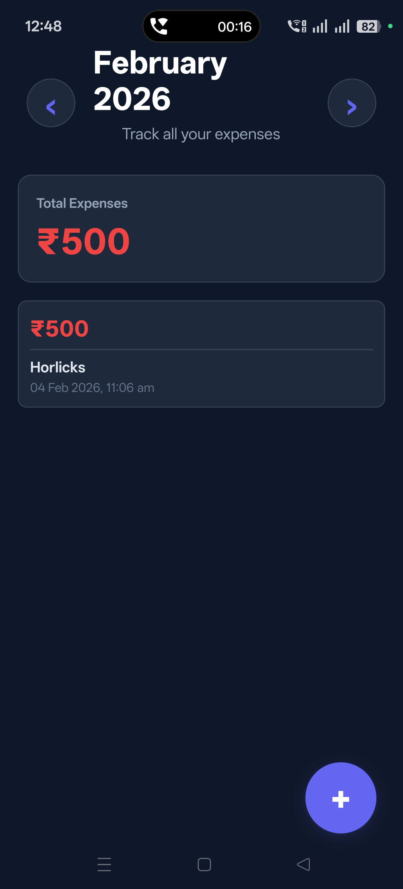<br />
<b>Expenses</b><br />
<sub>Daily expense tracking</sub>
</td>
</tr>
</table>

### 🍽️ Meal Management

<table>
<tr>
<td align="center" width="50%">
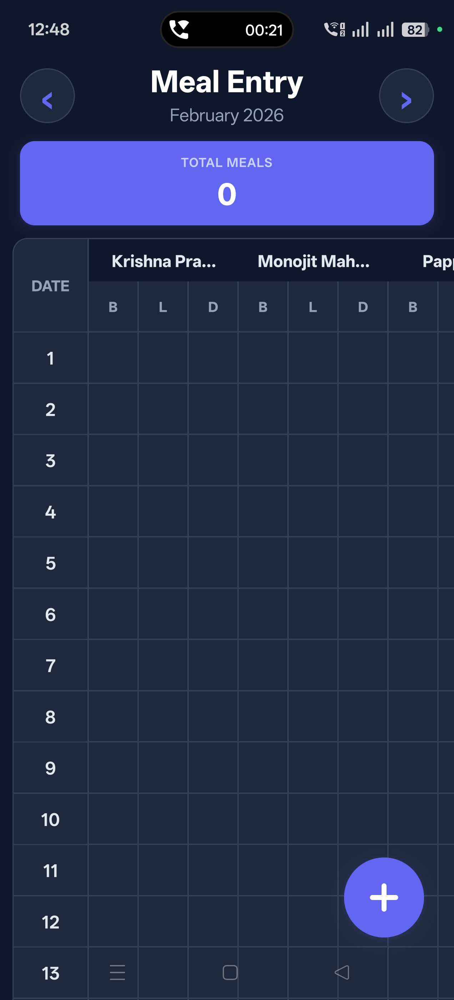<br />
<b>Meal Tracking</b><br />
<sub>Log daily meals</sub>
</td>
<td align="center" width="50%">
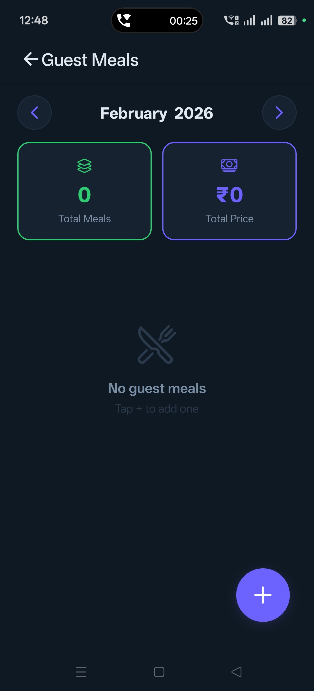<br />
<b>Guest Meals</b><br />
<sub>Manage guest meals</sub>
</td>
</tr>
</table>

</div>

---

## ✨ Features

<table>
<tr>
<td width="50%">

### 🔐 Authentication & Security
- ✅ Secure login/registration system
- ✅ Password recovery functionality
- ✅ Email verification
- ✅ Role-based access control (Manager/Member)
- ✅ Firebase Authentication integration

</td>
<td width="50%">

### 🏢 Mess Management
- ✅ Create new mess with custom settings
- ✅ Join existing mess with invite code
- ✅ Multi-mess support per user
- ✅ Manager and member roles
- ✅ Real-time data synchronization

</td>
</tr>
<tr>
<td width="50%">

### 👥 Member Management
- ✅ Add, edit, and remove members
- ✅ Track member profiles and details
- ✅ View member meal history
- ✅ Member status management
- ✅ Individual member balances

</td>
<td width="50%">

### 💰 Financial Tracking
- ✅ Record deposits and withdrawals
- ✅ Track daily/monthly expenses
- ✅ Automatic balance calculation
- ✅ Expense categorization
- ✅ Payment history logs
- ✅ Financial reports

</td>
</tr>
<tr>
<td width="50%">

### 🍴 Meal Management
- ✅ Log daily meals per member
- ✅ Track meal counts automatically
- ✅ Guest meal tracking
- ✅ Meal-based billing system
- ✅ Monthly meal summaries
- ✅ Fine management for missed meals

</td>
<td width="50%">

### 📊 Dashboard & Analytics
- ✅ Separate dashboards for managers and members
- ✅ Real-time statistics
- ✅ Expense analytics
- ✅ Meal consumption reports
- ✅ Balance overview
- ✅ Activity timeline

</td>
</tr>
<tr>
<td width="50%">

### 🔔 Notifications
- ✅ Send mess announcements
- ✅ Payment reminders
- ✅ Meal notifications
- ✅ In-app notifications
- ✅ Important updates

</td>
<td width="50%">

### 🌐 Additional Features
- ✅ Offline mode with data sync
- ✅ Dark mode support (planned)
- ✅ Cross-platform (iOS & Android)
- ✅ Responsive design
- ✅ Fast and lightweight

</td>
</tr>
</table>

---

## 🚀 Quick Start

### Prerequisites

Before you begin, ensure you have the following installed:

| Tool | Version | Download Link |
|------|---------|--------------|
| **Node.js** | 14.0+ | [Download](https://nodejs.org/) |
| **npm** or **yarn** | Latest | Comes with Node.js |
| **Expo CLI** | Latest | `npm install -g @expo/cli` |
| **Expo Go App** | Latest | [Android](https://play.google.com/store/apps/details?id=host.exp.exponent) \| [iOS](https://apps.apple.com/app/expo-go/id982107779) |
| **Firebase Account** | - | [Sign up](https://firebase.google.com/) |

---

## 📦 Installation

### 1️⃣ Clone the Repository

```bash
git clone https://github.com/pappu-dey/mess-app.git
cd mess-app
```

### 2️⃣ Install Dependencies

```bash
# Using npm
npm install

# OR using yarn
yarn install
```

### 3️⃣ Firebase Configuration

1. Create a new Firebase project at [Firebase Console](https://console.firebase.google.com/)
2. Enable **Authentication** (Email/Password)
3. Create a **Firestore Database**
4. Get your Firebase configuration
5. Update `firebase/firebaseConfig.ts` with your credentials:

```typescript
export const firebaseConfig = {
  apiKey: "YOUR_API_KEY",
  authDomain: "YOUR_AUTH_DOMAIN",
  projectId: "YOUR_PROJECT_ID",
  storageBucket: "YOUR_STORAGE_BUCKET",
  messagingSenderId: "YOUR_MESSAGING_SENDER_ID",
  appId: "YOUR_APP_ID"
};
```

### 4️⃣ Start Development Server

```bash
npx expo start
```

### 5️⃣ Run on Your Device

**Option A - Physical Device:**
1. Install **Expo Go** from Play Store (Android) or App Store (iOS)
2. Scan the QR code from terminal with Expo Go app
3. App will load automatically

**Option B - Emulator:**
- Press `a` for Android emulator
- Press `i` for iOS simulator (macOS only)
- Press `w` for web browser

---

## 🎯 Usage

### Development Commands

```bash
# Start development server
npx expo start

# Start with cleared cache
npx expo start -c

# Run on specific platform
npx expo start --android
npx expo start --ios
npx expo start --web

# Type checking
npx tsc --noEmit

# Linting
npm run lint
```

### Building for Production

```bash
# Using EAS Build (Recommended)
# First, install EAS CLI
npm install -g eas-cli

# Login to Expo account
eas login

# Configure EAS
eas build:configure

# Build for Android
eas build --platform android

# Build for iOS (requires Apple Developer account)
eas build --platform ios

# Build for both platforms
eas build --platform all
```

---

## 🏗️ Project Structure

```
mess-app/
│
├── 📁 app/                          # Application screens (Expo Router)
│   ├── 📁 auth/                     # Authentication screens
│   │   ├── login.tsx                # Login screen
│   │   ├── register.tsx             # Registration screen
│   │   ├── forgot.tsx               # Password recovery
│   │   ├── terms.tsx                # Terms of service
│   │   └── privacy.tsx              # Privacy policy
│   │
│   ├── 📁 mess/                     # Mess management screens
│   │   ├── create.tsx               # Create new mess
│   │   ├── join.tsx                 # Join existing mess
│   │   ├── select.tsx               # Select mess
│   │   ├── dashboard.tsx            # Main dashboard
│   │   ├── members.tsx              # Members management
│   │   ├── deposits.tsx             # Deposits tracking
│   │   ├── expenses.tsx             # Expenses management
│   │   ├── meals.tsx                # Meal logging
│   │   ├── guestmeal.tsx            # Guest meals
│   │   └── notifications.tsx        # Notifications
│   │
│   ├── _layout.tsx                  # Root layout
│   ├── index.tsx                    # Landing page
│   └── modal.tsx                    # Modal screens
│
├── 📁 components/                   # Reusable UI components
│   ├── 📁 ui/                       # UI primitives
│   │   ├── collapsible.tsx          # Collapsible component
│   │   ├── icon-symbol.tsx          # Icon components
│   │   └── icon-symbol.ios.tsx      # iOS-specific icons
│   │
│   ├── external-link.tsx            # External link component
│   ├── haptic-tab.tsx               # Tab with haptic feedback
│   ├── hello-wave.tsx               # Animated wave
│   ├── LogoutModal.tsx              # Logout confirmation
│   ├── OfflineBlocker.tsx           # Offline mode handler
│   ├── parallax-scroll-view.tsx     # Parallax scrolling
│   ├── Skeleton.tsx                 # Loading skeleton
│   ├── themed-text.tsx              # Themed text component
│   └── themed-view.tsx              # Themed view component
│
├── 📁 context/                      # React Context providers
│   ├── AppContext.tsx               # Global app state
│   ├── AuthContext.tsx              # Authentication state
│   └── NetworkContext.tsx           # Network connectivity
│
├── 📁 firebase/                     # Firebase configuration
│   ├── firebaseConfig.ts            # Firebase config
│   └── index.ts                     # Firebase exports
│
├── 📁 constants/                    # App constants
│   ├── theme.ts                     # Theme configuration
│   └── dummyData.ts                 # Mock data
│
├── 📁 hooks/                        # Custom React hooks
│   ├── use-color-scheme.ts          # Color scheme hook
│   ├── use-color-scheme.web.ts      # Web-specific hook
│   └── use-theme-color.ts           # Theme color hook
│
├── 📁 assets/                       # Static assets
│   ├── 📁 images/                   # App images
│   └── 📁 Mess-app-screenshot/      # App screenshots
│
├── 📄 app.json                      # Expo configuration
├── 📄 eas.json                      # EAS Build configuration
├── 📄 package.json                  # Dependencies
├── 📄 tsconfig.json                 # TypeScript config
├── 📄 babel.config.js               # Babel configuration
└── 📄 README.md                     # Documentation
```

---

## 🛠️ Tech Stack

<div align="center">

### Frontend & Mobile


### Backend & Database


### Development Tools


</div>

### Key Technologies & Libraries

- **Expo SDK**: Comprehensive development platform
- **Expo Router**: File-based routing system
- **Firebase Authentication**: Secure user authentication
- **Cloud Firestore**: Real-time NoSQL database
- **React Context API**: State management
- **TypeScript**: Type-safe development
- **React Hooks**: Modern React patterns

---

## 🤝 Contributing

We welcome contributions from the community! Here's how you can help make Mess App better:

### Ways to Contribute

- 🐛 **Report bugs** and issues
- 💡 **Suggest new features** or improvements
- 📖 **Improve documentation**
- 🔧 **Submit pull requests**
- ⭐ **Star the repository**
- 📢 **Share with others**

### How to Contribute

1. **🍴 Fork the repository**
   - Click the 'Fork' button at the top right of this page

2. **📥 Clone your fork**
   ```bash
   git clone https://github.com/YOUR_USERNAME/mess-app.git
   cd mess-app
   ```

3. **🌿 Create a feature branch**
   ```bash
   git checkout -b feature/amazing-feature
   ```

4. **✏️ Make your changes**
   - Write clean, well-documented code
   - Follow the existing code style
   - Test your changes thoroughly
   - Update documentation as needed

5. **💾 Commit your changes**
   ```bash
   git add .
   git commit -m 'Add: amazing new feature'
   ```

6. **📤 Push to your branch**
   ```bash
   git push origin feature/amazing-feature
   ```

7. **🎉 Open a Pull Request**
   - Go to the original repository
   - Click 'New Pull Request'
   - Provide a clear description of changes
   - Reference any related issues

### Code Style Guidelines

- ✅ Use **TypeScript** for all new files
- ✅ Follow **React Native** best practices
- ✅ Write **meaningful commit messages**
- ✅ Add **comments** for complex logic
- ✅ Keep **functions small** and focused
- ✅ **Update tests** when changing functionality
- ✅ Follow the existing **file structure**

### Commit Message Format

```
Type: Brief description (50 chars max)

Detailed explanation if needed.
Include motivation for the change.

Types: 
- Add: New feature
- Update: Modify existing feature
- Fix: Bug fix
- Remove: Remove feature
- Refactor: Code restructure
- Docs: Documentation only
- Style: Code formatting
- Test: Add or update tests
```

### Development Setup

```bash
# Install dependencies
npm install

# Run type checking
npx tsc --noEmit

# Run linter
npm run lint

# Start development server
npx expo start
```

---

## 📄 License

This project is licensed under the **MIT License**.

```
MIT License

Copyright (c) 2024 Pappu Dey

Permission is hereby granted, free of charge, to any person obtaining a copy
of this software and associated documentation files (the "Software"), to deal
in the Software without restriction, including without limitation the rights
to use, copy, modify, merge, publish, distribute, sublicense, and/or sell
copies of the Software, and to permit persons to whom the Software is
furnished to do so, subject to the following conditions:

The above copyright notice and this permission notice shall be included in all
copies or substantial portions of the Software.

THE SOFTWARE IS PROVIDED "AS IS", WITHOUT WARRANTY OF ANY KIND, EXPRESS OR
IMPLIED, INCLUDING BUT NOT LIMITED TO THE WARRANTIES OF MERCHANTABILITY,
FITNESS FOR A PARTICULAR PURPOSE AND NONINFRINGEMENT. IN NO EVENT SHALL THE
AUTHORS OR COPYRIGHT HOLDERS BE LIABLE FOR ANY CLAIM, DAMAGES OR OTHER
LIABILITY, WHETHER IN AN ACTION OF CONTRACT, TORT OR OTHERWISE, ARISING FROM,
OUT OF OR IN CONNECTION WITH THE SOFTWARE OR THE USE OR OTHER DEALINGS IN THE
SOFTWARE.
```

See the [LICENSE](LICENSE) file for full details.

---

## 📞 Contact & Support

<div align="center">

### 💬 Get in Touch

[](https://github.com/pappu-dey)
[](mailto:deypappu144@gmail.com)
[](mailto:xtpdev@gmail.com)

</div>

| Contact Type | Details |
|-------------|---------|
| 👨‍💻 **Developer** | Pappu Dey |
| 📧 **Personal Email** | deypappu144@gmail.com |
| 🆘 **Support Email** | xtpdev@gmail.com |
| 🐛 **Bug Reports** | [Open an Issue](https://github.com/pappu-dey/mess-app/issues) |
| 💡 **Feature Requests** | [Request Feature](https://github.com/pappu-dey/mess-app/issues/new?labels=enhancement) |
| 📖 **Documentation** | [Wiki](https://github.com/pappu-dey/mess-app/wiki) |
| 💬 **Discussions** | [GitHub Discussions](https://github.com/pappu-dey/mess-app/discussions) |

---

## 🌟 Show Your Support

If this project helped you or your mess, please consider:

<div align="center">

⭐ **Star this repository**  
🐛 **Report bugs** you encounter  
💡 **Suggest features** you'd like  
🤝 **Contribute** to the codebase  
📢 **Share** with other messes/hostels

<br />

[](https://github.com/pappu-dey/mess-app/stargazers)
[](https://github.com/pappu-dey/mess-app/network/members)
[](https://github.com/pappu-dey/mess-app/watchers)
[](https://github.com/pappu-dey/mess-app/issues)

</div>

---

## 🗺️ Roadmap

### 🚀 Version 2.0 (Next Release)
- [ ] 🌙 Dark mode support with theme switcher
- [ ] 📴 Enhanced offline mode with local storage
- [ ] 🌍 Multi-language support (Hindi, Bengali, English)
- [ ] 💳 Payment gateway integration (Razorpay, Paytm, PhonePe)
- [ ] 📊 Advanced expense analytics with charts
- [ ] 🔔 Push notifications for important events

### 🎯 Version 2.5 (Future)
- [ ] 📄 PDF report generation for monthly statements
- [ ] 📧 Email notifications and reminders
- [ ] 📱 QR code for quick attendance marking
- [ ] 🔄 Auto-backup to Google Drive/Dropbox
- [ ] 👥 Group chat for mess members
- [ ] 📈 Predictive analytics for expenses

### 🌐 Version 3.0 (Long-term)
- [ ] 🌐 Web admin panel for desktop management
- [ ] ☁️ Cloud sync across multiple devices
- [ ] 👨‍💼 Advanced role-based permissions
- [ ] 📱 Desktop app (Windows, macOS, Linux)
- [ ] 🔐 Two-factor authentication (2FA)
- [ ] 🤖 AI-powered expense suggestions
- [ ] 🏆 Gamification and achievements
- [ ] 📊 Business intelligence dashboard

---

## ❓ FAQ

<details>
<summary><b>How do I report a bug?</b></summary>

To report a bug:
1. Go to the [Issues](https://github.com/pappu-dey/mess-app/issues) page
2. Click "New Issue"
3. Include:
   - Clear description of the bug
   - Steps to reproduce
   - Expected vs actual behavior
   - Screenshots/screen recordings if applicable
   - Device info (OS, model, app version)
</details>

<details>
<summary><b>Can I use this for my hostel/mess?</b></summary>

Absolutely! This is open-source software under MIT License. You can:
- Use it for your mess/hostel (free, forever)
- Customize it to your needs
- Deploy it commercially
- Fork and create your own version

Just maintain the original license notice.
</details>

<details>
<summary><b>Is this production-ready?</b></summary>

Yes! The app is functional and actively used. However:
- ✅ Suitable for small to medium-sized messes (up to 50 members)
- ✅ All core features are stable
- ⚠️ Test thoroughly before full deployment
- ⚠️ Have a backup plan for critical data
- 🔄 Regular updates and improvements are ongoing
</details>

<details>
<summary><b>How can I contribute?</b></summary>

We welcome all contributions! You can:
- Report bugs or suggest features
- Improve documentation
- Fix bugs or add features via pull requests
- Share the app with others
- Provide feedback

Check the [Contributing](#-contributing) section for detailed guidelines.
</details>

<details>
<summary><b>Does it work offline?</b></summary>

Currently, the app requires internet connectivity for Firebase sync. However:
- ✅ Basic offline detection is implemented
- ✅ Shows offline status to users
- 🔄 Full offline mode with local caching is planned for Version 2.0
- 📱 Data will sync automatically when connection is restored
</details>

<details>
<summary><b>What are the Firebase costs?</b></summary>

For small to medium messes:
- ✅ Firebase Free tier is usually sufficient
- ✅ Supports up to 50K reads/day and 20K writes/day
- ✅ 1GB storage included
- 💰 Costs only if you exceed free tier limits
- 📊 Monitor usage in Firebase Console
</details>

<details>
<summary><b>Can I customize the app for my specific needs?</b></summary>

Yes! The codebase is:
- ✅ Well-organized and documented
- ✅ Built with TypeScript for type safety
- ✅ Uses modular component architecture
- ✅ Easy to extend and customize
- 📖 Check the code structure in [Project Structure](#️-project-structure)
</details>

---

## 📊 Statistics

<div align="center">


</div>

---

## 🙏 Acknowledgments

Special thanks to:

- 🎉 **Expo Team** - For the amazing development platform
- ⚛️ **React Native Community** - For continuous support and resources
- 🔥 **Firebase Team** - For the powerful backend infrastructure
- 👥 **All Contributors** - For helping improve this project
- 🏫 **Hostel Communities** - For feedback and feature suggestions
- ❤️ **Early Adopters** - For testing and reporting issues

---

## 📚 Additional Resources

- 📖 [Expo Documentation](https://docs.expo.dev/)
- ⚛️ [React Native Docs](https://reactnative.dev/docs/getting-started)
- 🔥 [Firebase Documentation](https://firebase.google.com/docs)
- 📘 [TypeScript Handbook](https://www.typescriptlang.org/docs/)
- 🎨 [React Navigation](https://reactnavigation.org/)

---

## 🔒 Security

If you discover a security vulnerability, please email us at **xtpdev@gmail.com** instead of opening a public issue. We take security seriously and will respond promptly.

---

<div align="center">

### 💖 Made with passion by [Pappu Dey](https://github.com/pappu-dey)

**⭐ Star this repository if you found it helpful!**

---

**[⬆️ Back to Top](#-mess-app)**

---

*Simplifying mess management, one meal at a time* 🍽️

</div>
